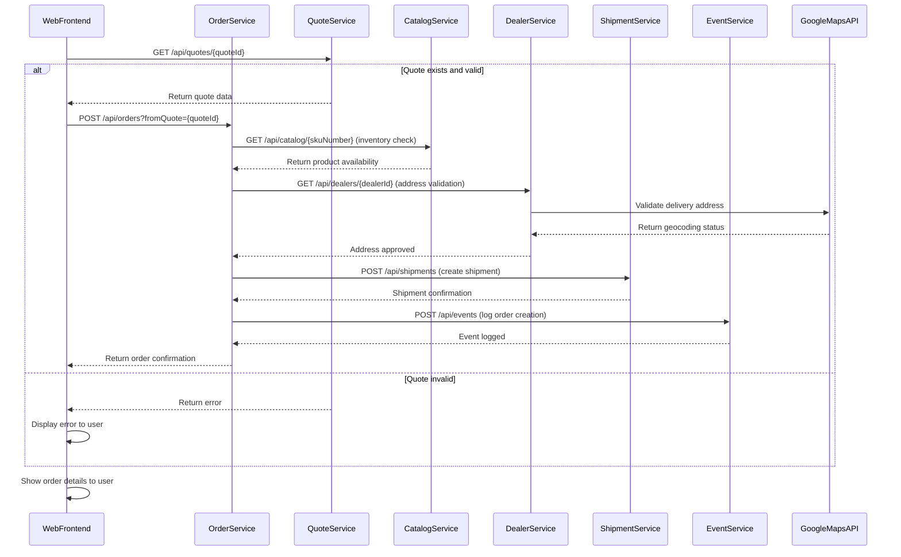
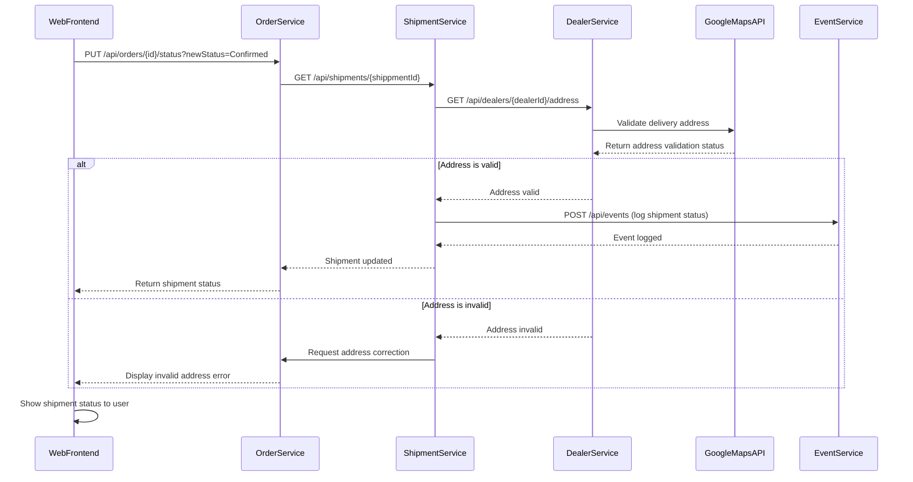
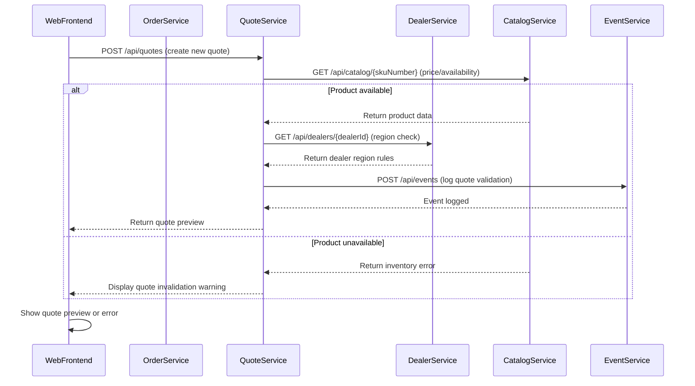
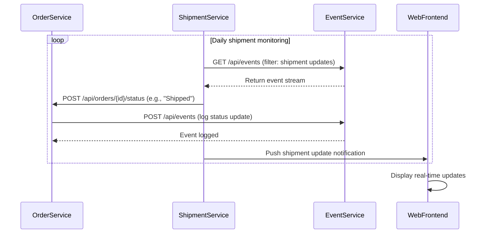
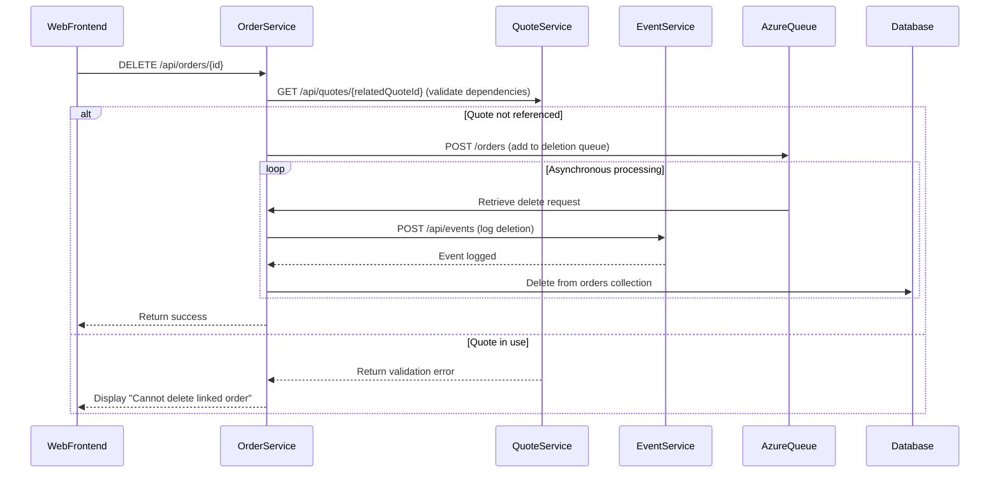

<think>
Okay, I need to create dynamic interaction flows and sequence diagrams based on the given codebase summary. The user wants to capture key user workflows, communication patterns, data flows, event-driven interactions, and error handling. Let me start by understanding the system's components and interactions.

First, from the codebase summary, the main services are OrderService, QuoteService, CatalogService, DealerService, ShipmentService, and IntegrationService. They interact with each other via REST APIs and Azure Queues. The Web Frontend is a user interface that communicates with these services. Each service has its own responsibilities and data models. The Infrastructure includes MongoDB and PostgreSQL for data storage.

The key workflows would likely be:
1. **Order Creation from Quote** - User creates an order after submitting a quote.
2. **Quote Validation** - Ensuring the quote has valid data before order creation.
3. **Address Validation for Shipping** - Using Google Maps to validate delivery addresses.
4. **Event Logging** - Recording order and shipment updates in the application insights.

I need to identify each workflow's purpose, triggers, communication methods, and potential error paths. Let me start with the first workflow.

**Order Creation from Quote**:
- **Trigger**: User submits a request in the Web Frontend to convert a quote into an order.
- **Components Involved**: Web Frontend, QuoteService, OrderService, CatalogService, DealerService, ShipmentService, EventService.
- **Steps**:
  1. Web Frontend requests the quote data from QuoteService.
  2. QuoteService validates the quote.
  3. OrderService creates a new order, checking inventory with CatalogService.
  4. DealerService validates the dealer's address.
  5. ShipmentService notifies of address approval.
  6. EventService logs the order creation.

**Communication Patterns**:
- REST calls between services.
- EventService uses Application Insights for logging.

Next, **Quote Validation**:
- **Trigger**: When a quote is saved or submitted.
- **Components**: Web Frontend, QuoteService, CatalogService, DealerService.
- **Steps**:
  1. Web Frontend sends quote data to QuoteService.
  2. QuoteService validates product availability via CatalogService.
  3. DealerService validates dealer address and region.
  4. If valid, QuoteService updates the status.

**Error Handling**:
- If inventory is low, the service returns an error.
- If address is invalid, dealers inform the frontend.

**Address Validation**:
- **Trigger**: When user submits a shipment address.
- **Components**: Web Frontend, DealerService, Google Maps API.
- **Steps**:
  1. User enters an address in the frontend.
  2. DealerService calls Google Maps API to validate.
  3. Results sent back to frontend.

**Communication**: REST for Google Maps.

**Event Logging**:
- **Trigger**: Order or shipment status changes.
- **Components**: OrderService, ShipmentService, EventService.
- **Steps**:
  1. OrderService updates status.
  2. EventService logs the event to Application Insights.
  3. ShipmentService logs delivery events.

**Error Handling**: If logging fails, retries via the queue system.

Now, I need to translate these workflows into Mermaid sequence diagrams. Let me outline each diagram with the steps and interactions. For example, the order creation flow would involve multiple services and checks. Each step should be a message in the diagram. Similarly, error handling would require additional messages for error responses.

I also need to ensure that the diagrams capture synchronous vs. asynchronous interactions. REST calls are synchronous (showed with straight arrows), while queue-based interactions (like event logging) would be asynchronous (dashed arrows or separate components).

Let me verify that all key components are included in each diagram. For instance, in the order creation workflow, the Web Frontend triggers the process, then interacts with QuoteService, OrderService, and so on.

I should also note each communication pattern (e.g., REST, queue) and ensure that the error handling steps are represented as alternatives in the flow (alt/else blocks in Mermaid).

By carefully mapping each workflow's steps, identifying components, and specifying communication types, I can create accurate and comprehensive Mermaid diagrams for the user's request.
</think>

