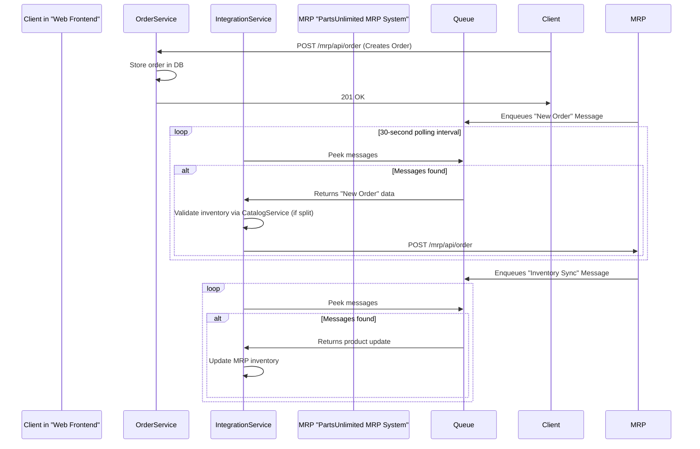

<think>
Okay, let's tackle this problem step by step. I need to create an architectural summary for a codebase based on the given chunks. The user provided four chunks of text from the codebase and wants a comprehensive summary that covers components, responsibilities, APIs, databases, dependencies, business logic, config, and architectural patterns. Then, I have to focus on microservice decomposition possibilities with detailed service diagrams.

First, I'll go through each chunk to identify key elements. 

Chunk 1 is the introduction, mentioning PartsUnlimitedMRP with Java, Linux, Apache, MongoDB. It includes Dockerfiles, ARM templates, Ansible scripts, and Spring Boot components for OrderService and IntegrationService. The client is a WAR file for Tomcat, and there's mention of Puppet, Chef, and Jenkins for build automation. So, key components here are OrderService, IntegrationService, Clients (web frontend), MongoDB, PostgreSQL, and infrastructure code.

Chunk 2 has ARM templates for Azure resources: Availability Set, Load Balancer, VNet, VMs. Also, Java services for OrderProcessing and Queue handling. Playbooks for VM deployment with Ansible, Puppet, and Chef. The OrderService uses Spring Boot, REST APIs, and connects to MongoDB or PostgreSQL. It has scheduled tasks for integration with MRP. The IntegrationService handles background tasks and connects to MRP via REST. Build configurations with Travis CI and Docker files are present.

Chunk 3 dives into the OrderService's Java code, with models like Quote, Order, ShipmentRecord. Repository interfaces and MongoDB implementations with retry logic. Unit tests using JUnit and Test containers. The client side has data.js for API interactions and WinJS for UI binding.

Chunk 4 is a web client in JavaScript using WinJS for single-page app (SPA) navigation. It has components for catalog, dealers, orders, etc., with a navigator.js and date.js utility. The data.js module handles REST interactions to the backend API endpoints.

Putting this together, the architecture is a monolithic application with separation between web clients, OrderService, and IntegrationService, but they are tightly coupled. Each service interacts with databases (MongoDB and PostgreSQL) and uses infrastructure automation (ARM, Docker, Ansible). The OrderService handles both UI and backend logic, with REST APIs for clients. The client is a WAR file, but the web frontend seems to be a single-page application with JavaScript and HTML, interacting via REST.

For microservice decomposition, I need to identify which parts could be separated. The OrderService currently includes quote management, order processing, shipment tracking, and integration tasks. These could be split into separate services: CatalogService, QuoteService, OrderService, ShipmentService, IntegrationService. The client could be split into separate microservices for each domain, like CatalogUI, OrderUI, etc. The databases are currently shared but could be separated per service as well.

I should outline the key components in the current architecture, their responsibilities, API endpoints, database schemas, dependencies (like OrderService depending on MRP via REST or queues), business logic in models and services, configuration files, and architectural patterns (SPI, CQRS, REST, etc.). Then, identify areas where components can be decoupled into microservices, maybe with some diagrams using Mermaid for sequence flows and service interactions.

Need to make sure to cover all the elements the user requested: component names, responsibilities, APIs, databases, dependencies, business logic, config, and architectural patterns. Then focus on microservice decomposition with diagrams and explanations.
</think>

# Architectural Summary for PartsUnlimitedMRP Codebase

---

## 1. Key Components and Responsibilities

| **Component**            | **Responsibility**                                                                 | **Technology Stack**                       |
|--------------------------|-----------------------------------------------------------------------------------|--------------------------------------------|
| **Clients**              | Web frontend for user interaction (catalog, orders, shipments)                   | HTML, JavaScript, WinJS                    |
| **OrderService**         | Manages order/quote lifecycle, inventory validation, and shipment coordination   | Java, Spring Boot, REST API                |
| **IntegrationService**   | Background tasks, external system integration via queues/MRP API                 | Java, Spring Boot, Azure Storage Queues    |
| **Database Layer**       | Data persistence for quotes, orders, shipments, and dealer/catalog information   | MongoDB (NoSQL), PostgreSQL (Relational)   |
| **Infrastructure Layer** | VM provisioning, network configuration, and deployment automation                | ARM Templates, Docker, Ansible, Puppet     |

---

## 2. API Endpoints and Interfaces

### **Client-Server Communication**
- **Clients** (JavaScript) ↔ **OrderService** (REST API)
  ```http
  GET /mrp/catalog/ 
  POST /mrp/api/order
  GET /mrp/api/quotes/{id}
  POST /mrp/api/shipments
  ```

- **IntegrationService** ↔ **OrderService**
  - **Internal REST API**:  
    ```http
    POST /mrp/api/internal/orders
    ```
  - **Azure Storage Queues**:  
    ```plaintext
    orders-queue (for incoming order data)
    inventory-sync-queue (for product updates)
    ```

- **IntegrationService** ↔ **PartsUnlimited Website (MRP System)**
  - REST API endpoints:  
    ```http
    POST /mrp/api/order
    POST /mrp/api/product
    ```

---

## 3. Database Schema

### **MongoDB Collections**
```json
{
  "_id": "ObjectId",
  "quoteId": "string",
  "customerName": "string",
  "dealerName": "string",
  "quoteItems": [
    { "sku": "A123", "amount": 5 },
    { "sku": "B456", "amount": 2 }
  ],
  "totalCost": "number",
  "discount": "number",
  "city": "string",
  "postalCode": "string",
  "state": "string"
}
```

### **PostgreSQL Tables**
```sql
CREATE TABLE orders (
  order_id VARCHAR PRIMARY KEY,
  quote_id VARCHAR REFERENCES quotes(quote_id),
  order_date TIMESTAMPTZ,
  status VARCHAR,
  events JSON[]
);
```

---

## 4. Service Dependencies and Communication Patterns

### **Synchronous (REST API)**
- **Clients** ⟶ **OrderService**: HTTP REST calls for creating orders and querying shipments.
- **IntegrationService** ⟶ **OrderService**: REST API calls to retrieve and process orders from the database.

### **Asynchronous (Queues)**
- **PartsUnlimited Website** ⟶ **IntegrationService**:
  - Orders placed on the website are added to `orders-queue` (Azure Storage Queue).
  - **Polling Mechanism** in `CreateOrderProcessTask.java` processes these orders every 30 seconds.
- **IntegrationService** ⟶ **PartsUnlimited MRP**:  
  - Inventory updates are sent to the MRP system via Azure Storage Queue (`inventory-sync-queue`).

---

## 5. Key Business Logic and Algorithms

### **Order Lifecycle Management** (Java Service)
- **CreateOrderProcessTask.java**:  
  - Polls Azure Queue for "new order" messages.
  - Validates inventory constraints using `CatalogItemsRepository.java`.
  - Invokes MRP system REST API to create an order.
- **UpdateProductProcessTask.java**:  
  - Polls queue for product updates from the website.
  - Updates MRP system inventory in real-time.

### **Client-Side Validation** (JavaScript)
- `data.js` ensures orders are created only for valid quotes (from MRP).
- Uses `WinJS.Binding.List` to bind order data to the UI and track changes.

---

## 6. Configuration Management

### **OrderService** (`application.properties`)
```properties
ordering.storage=mongodb
mrp.endpoint=http://127.0.0.1:8080  # MRP REST API
```

### **Clients** (`serverconfig.js`)
```javascript
var baseAddress = 'http://' + window.location.hostname + ':8080'
```

---

## 7. Architectural Patterns Used

1. **Monolithic Architecture with Logical Separation**
   - Tightly coupled Java backend services (OrderService and IntegrationService) but separated by duty.
   - Frontend is loosely coupled via REST API.

2. **Synchronous REST API for Frontend Interaction**
   - Direct HTTP calls between client and backend for immediate user feedback.

3. **Asynchronous Queue-Driven Integration (CQRS Pattern)**
   - Orders placed on the website are decoupled from processing via Azure Storage Queues.
   - Enables eventual consistency in integration tasks.

4. **Single-Page Application (SPA) Pattern**
   - JavaScript frontend handles UI rendering and API interactions.
   - Uses `WinJS.Navigation` for dynamic page transitions.

5. **Repository Pattern**
   - Java `Repository` classes abstract database operations (e.g., `MongoOrderRepository.java`).
   - Allows switching between in-memory and MongoDB storage via `RepositoryFactory.java`.

6. **Infrastructure as Code (IaC)**
   - ARM templates (`PartsUnlimitedSSHMRP.json`) automate Azure VM creation and deployment.
   - Ansible playbooks (`new_ARM_deployment.yml`) manage VM setup (e.g., installing Apache, Java, MongoDB).

---

# 8. Microservice Decomposition Analysis

## **Decomposition Candidates**

### **1. CatalogService**
- **Purpose**: Manage product inventory and catalog items.
- **APIs**:  
  ```http
  GET /api/product/{sku}
  PUT /api/product/{sku}/inventory
  ```

### **2. QuoteService**
- **Purpose**: Generate and validate customer quotes.
- **APIs**:  
  ```http
  POST /api/quotes
  GET /api/quotes/{id}
  ```

### **3. OrderService**
- **Purpose**: Manage order creation, status tracking, and delivery coordination.
- **APIs**:  
  ```http
  POST /api/orders
  GET /api/orders/{id}
  ```

### **4. ShipmentService**
- **Purpose**: Track shipments and update delivery status.
- **APIs**:  
  ```http
  POST /api/shipments
  GET /api/shipments/{id}
  ```

### **5. IntegrationService**
- **Purpose**: Coordinate with external systems via queues.
- **APIs**:  
  ```http
  GET /api/integration/orders
  POST /api/integration/inventory
  ```

---

## **Sequence Diagram for Order Processing Workflow**



---

## **Next-Step Recommendations**

1. **Refactor OrderIntegrationTasks**:
   - Split `CreateOrderProcessTask` and `UpdateProductProcessTask` into separate microservices if integration with external tools expands.

2. **Extract Domain Models**:
   - Move `Quote`, `Order`, and `ShipmentRecord` models into their own services to better support independent scaling and deployment.

3. **Implement Service Mesh**:
   - Use Istio or Linkerd for service discovery, traffic control, and error resilience as microservices mature.

4. **Adopt CQRS Pattern**:
   - Improve scalability by separating read and write operations for high-traffic endpoints (e.g., catalog queries).

5. **Decouple Integrations**:
   - Use event-driven architecture (Kafka or Event Hubs) instead of pull-based Azure Queues to reduce polling and improve real-time responsiveness.

6. **Standardize API with Protobuf/REST Contracts**:
   - Formalize API contracts to ensure compatibility during microservice decomposition and updates.

---

This analysis provides a roadmap for decomposing the application into microservices, highlighting key boundary layers and interaction patterns that should be preserved during the transition.