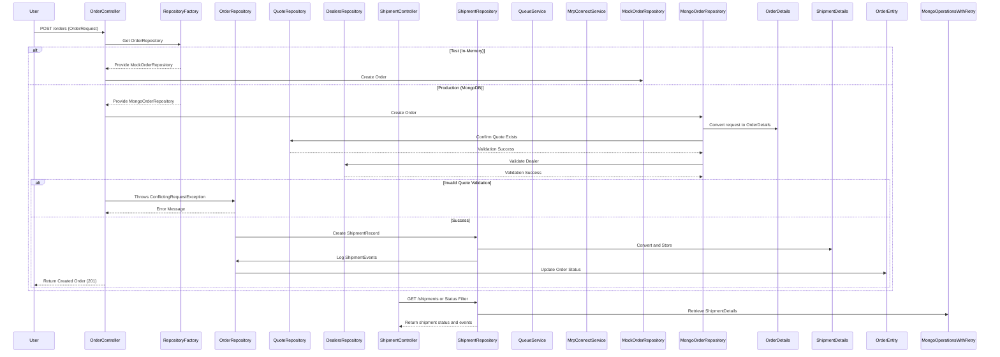
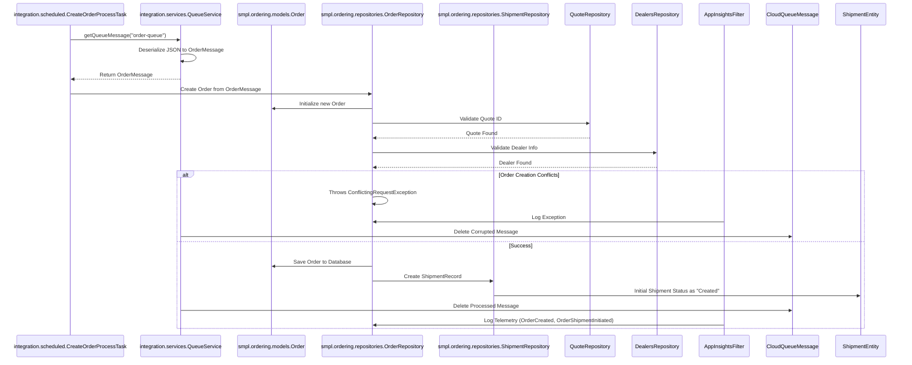
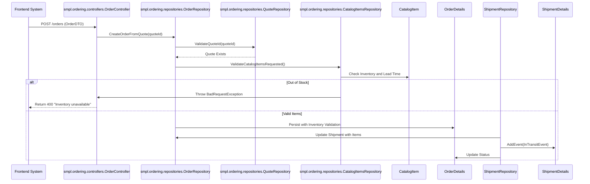
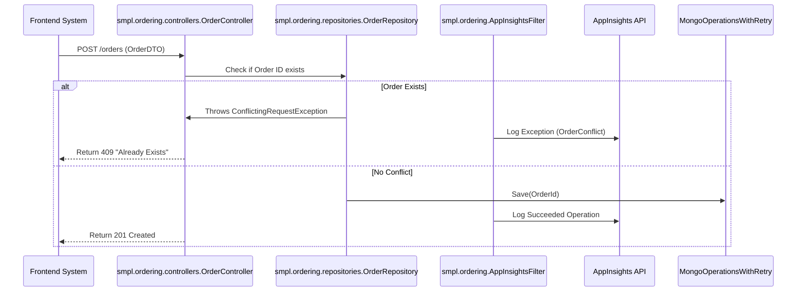

<think>
Okay, let's see. The user wants me to analyze the PartsUnlimitedMRP codebase and create dynamic interaction flows and sequence diagrams for key user workflows. I need to cover five aspects for each major workflow: step-by-step interactions using Mermaid, workflow purpose and triggers, communication patterns, data flow, event-driven interactions, and error handling.

First, I'll go back through the provided summaries. The repository has a clear layered architecture with web tier, integration, business logic, data access, and testing. Key functionalities include order lifecycle management, shipment tracking, dealer integration, and monitoring. The main interaction layers are the web controllers, repository classes (both mock and MongoDB), and the integration services using Azure queues.

Looking at the integration layer, there's a scheduled task system that interacts with MrpConnectService and QueueService. The ShipmentController and OrderController in the web tier handle REST endpoints. The repositories, especially the MongoDB ones, manage persistence and have retry mechanisms. There's also test infrastructure that uses both mocks and real DB connections for validation.

So, possible workflows could be:
1. Order Processing Workflow: User submits an order via a REST API, which gets processed by the OrderController, interacts with repositories (Mongo or mock) to retrieve related quote and dealer info, possibly enqueues a task for asynchronous processing.
2. Inventory Update via Queue: A background scheduled task periodically pulls data from MRP systems, updates the inventory via a repository and pushes to a queue for the website or other services.
3. Shipment Creation and Tracking: After order creation, a shipment is generated, tracked through the system using events, and updated via a shipment controller and repository.

I should start by identifying these workflows and mapping out the steps. For each, I need to detail the components involved and the interactions. Let's pick the order processing as a primary workflow. The user would hit the OrderController with a POST request, which then uses RepositoryFactory to get the right repository (MongoOrderRepository), communicates with QuoteRepository and DealersRepository, then interacts with the ShipmentController or ShipmentRepository. Also, there's exception handling if the order is invalid or if there are conflicts.

Another key flow is the scheduled tasks. UpdateProductProcessTask might interact with MrpConnectService to fetch data, then QueueService to enqueue messages. Then, CreateOrderProcessTask might dequeue these messages and process them, updating the order status in the repositories. This would be event-driven with both synchronous and asynchronous communication.

Shipment tracking would involve the ShipmentController receiving GET/PUT/POST requests, using the ShipmentRepository to interact with MongoDB, perhaps interacting with the OrderRepository to ensure order status is correct, and adding events via ShipmentEventInfo. Error handling here would be if the shipment doesn't exist or the order isn't valid.

For the sequence diagrams, I need to represent each of these flows with components as objects. Use REST calls where appropriate, events or message queues for async interactions, and MongoDB interactions for data persistence. Also, note the error handling, like catching exceptions and logging them.

I need to ensure the communication patterns are clearly noted—asynchronous via Queue, synchronous via REST, data access via repositories. Also, the data flow during operations, such as during order creation involving the quote and dealer data.

I should structure each workflow: Order creation from a quote, using REST with possible async message sending via QueueService. Then the background task processing the queue messages to update order and inventory. Shipment creation would involve OrderController validating the order status and then passing to ShipmentRepository.

Make sure to detail all these steps in the Mermaid diagrams, showing the components and their interactions. For error handling, illustrate scenarios like invalid quotes, missing dealers, etc., and how exceptions are handled.
</think>

### Workflow 1: **Order Creation from Quote (Synchronized with MRP and Shipment systems)**  
**Description**: A user or system component creates an order based on an approved quote, triggering synchronization of order and shipment data across components. This workflow ensures the MRP system validates the quote, creates the order, updates inventory, and initiates shipment tracking through repositories and backend services.  
**Trigger**: `POST /orders` request to `OrderController`, with a valid `QuoteId` and dealer catalog.  

**Mermaid Sequence Diagram**:


---

### Workflow 2: **Product Inventory Sync via Scheduled Task**  
**Description**: Periodically synchronizes product catalog data from MRP to inventory consumers (e.g., PartsUnlimited website) via Azure queue, ensuring inventory availability and lead times are up to date.  
**Trigger**: Scheduling via Spring's `@Scheduled` at interval `SCHEDULED_INTERVAL` (30,000ms).  

**Mermaid Sequence Diagram**:
```mermaid
sequenceDiagram
    participant Scheduler as integration.scheduled.UpdateProductProcessTask
    participant MrpConnectService as integration.services.MrpConnectService
    participant QueueFactory as integration.services.QueueFactory
    participant QueueService as integration.services.QueueService
    participant ProductItem as integration.models.website.ProductItem

    Scheduler->>MrpConnectService: GET /mrp/products
    MrpConnectService->>MrpConnectService: Build URI via ConfigurationManager
    MrpConnectService->>MrpConnectService: Use RestTemplate to fetch
    MrpConnectService-->>Scheduler: Return List of CatalogItems

    Scheduler->>QueueFactory: getQueue("inventory-sync-topic")
    QueueFactory->>QueueService: addQueueMessage(queue, ProductMessage)
    QueueService->>ProductMessage: Serialize CatalogItems to ProductMessage
    QueueService->>AzureCloudQueue: AddMessage
    QueueService-->>QueueFactory: Return QueueResponse

    Note: Shipment Consumers (e.g., PU Website) dequeue and process ProductItem
    QueueService->>ProductItem: Deserialize ProductMessage to ProductItems
    ProductItem-->>Website/Logistics: Update Catalog Items and Prices
```

---

### Workflow 3: **Order Processing Task via Azure Queue (Background Task)**  
**Description**: A scheduled task (`CreateOrderProcessTask`) processes orders enqueued via Azure queues, reducing web tier latency while ensuring order integrity.  
**Trigger**: Background polling of Azure order queue initiated by scheduled task.  

**Mermaid Sequence Diagram**:


---

### Workflow 4: **Shipment Progress Tracking (Event-Driven)**  
**Description**: External logistics systems push shipment status updates to the MRP application via events, updating the shipment record and order status.  
**Trigger**: "truck is on its way" event sent by logistics partner (webhook or inbound REST request).  

**Mermaid Sequence Diagram**:
```mermaid
sequenceDiagram
    participant LogisticsPartner as External Logistics System
    participant ShipmentController as smpl.ordering.controllers.ShipmentController
    participant ShipmentRepository as smpl.ordering.repositories.ShipmentRepository
    participant OrderRepository as smpl.ordering.repositories.OrderRepository
    participant ShipmentDetails as smpl.ordering.repositories.mongodb.models.ShipmentDetails

    LogisticsPartner->>ShipmentController: UPDATE /shipments/{id}
    ShipmentController->>ShipmentRepository: GetShipmentById
    ShipmentRepository->>MongoOperationsWithRetry: Retrieve ShipmentDetails
    ShipmentRepository-->>ShipmentController: Return ShipmentRecord

    ShipmentController->>ShipmentRepository: AddEvent(ShipmentEventInfo)
    ShipmentRepository->>OrderRepository: Update Order Status (e.g., Shipped)
    OrderRepository->>OrderDetails: Update Status and Event History
    OrderRepository->>MongoOperationsWithRetry: Save Order Entity
    Notes: Events via ShipmentEventInfo array in ShipmentDetails
```

---

### Workflow 5: **Inventory Validation for Order Items**  
**Description**: Ensures requested parts (from an order) are in stock and valid based on `CatalogItem` data prior to order creation.  
**Trigger**: Order submission from frontend (REST) with an attached quote.  

**Mermaid Sequence Diagram**:


---

### Error Handling Flow: **Duplicate Order Detection**  
**Description**: Ensures the system handles invalid inputs (e.g., duplicate orders) via exception interception.  
**Trigger**: Duplicate order insertion due to concurrent user/front-end activity.  

**Mermaid Sequence Diagram**:
